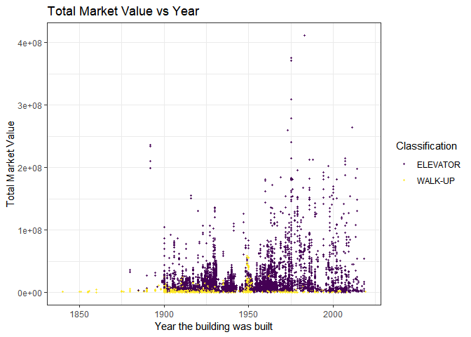

Exploratory
================
2022-11-25

# Preprocessing

## parts to be completed (add as your wish)

| Contents                          | Stage | Comments                |
|-----------------------------------|-------|-------------------------|
| separate observations             | √     |                         |
| NAs (error value)                 |       | na.omit()  other error? |
| add explanations to each variable |       |                         |
| link the address to lat&lon       |       | other ways to plot map? |
| simple scatter/box plots          |       |                         |

``` r
library(tidyverse)
library(corrplot)
library(sf)
```

In the origin data, each properties are compared with three comparable
rentals. So in total, information of four building(sets) forms one
observation.

``` r
comparable_rental_income_raw = read_csv("data/DOF__Cooperative_Comparable_Rental_Income__Citywide.csv") %>%
  janitor::clean_names() %>% 
  mutate(
    building_classification = str_remove_all(building_classification, "\\s"),
    building_classification_1 = str_remove_all(building_classification_1, "\\s"),
    building_classification_2 = str_remove_all(building_classification_2, "\\s"),
    building_classification_3 = str_remove_all(building_classification_3, "\\s")
  )
```

    ## Rows: 44960 Columns: 60
    ## ── Column specification ──────────────────────────
    ## Delimiter: ","
    ## chr (16): Boro-Block-Lot, Address, Neighborhood, Building Classification, Bo...
    ## dbl (44): Total Units, Year Built, Gross SqFt, Estimated Gross Income, Gross...
    ## 
    ## ℹ Use `spec()` to retrieve the full column specification for this data.
    ## ℹ Specify the column types or set `show_col_types = FALSE` to quiet this message.

``` r
head(comparable_rental_income_raw)
```

    ## # A tibble: 6 × 60
    ##   boro_block_lot address neigh…¹ build…² total…³ year_…⁴ gross…⁵ estim…⁶ gross…⁷
    ##   <chr>          <chr>   <chr>   <chr>     <dbl>   <dbl>   <dbl>   <dbl>   <dbl>
    ## 1 1-00011-0014   26 BEA… FINANC… D4-ELE…      21    1909   51387  2.40e6    46.7
    ## 2 1-00028-0001   3 HANO… FINANC… D0-ELE…     211    1926  239121  9.46e6    39.6
    ## 3 1-00094-0001   80 GOL… SOUTHB… D4-ELE…    1652    1971 2155492  6.81e7    31.6
    ## 4 1-00100-0026   138 NA… SOUTHB… D4-ELE…      43    1901   79422  3.13e6    39.4
    ## 5 1-00117-0001   185 PA… CIVIC … D4-ELE…     465    1960  515425  2.59e7    50.2
    ## 6 1-00134-0025   258 BR… CIVIC … D4-ELE…      45    1915   88320  4.24e6    48  
    ## # … with 51 more variables: estimated_expense <dbl>, expense_per_sq_ft <dbl>,
    ## #   net_operating_income <dbl>, full_market_value <dbl>,
    ## #   market_value_per_sq_ft <dbl>, boro_block_lot_1 <chr>, address_1 <chr>,
    ## #   neighborhood_1 <chr>, building_classification_1 <chr>, total_units_1 <dbl>,
    ## #   year_built_1 <dbl>, gross_sq_ft_1 <dbl>, estimated_gross_income_1 <dbl>,
    ## #   gross_income_per_sq_ft_1 <dbl>, estimated_expense_1 <dbl>,
    ## #   expense_per_sq_ft_1 <dbl>, net_operating_income_1 <dbl>, …

``` r
comparable_rental_income = 
  comparable_rental_income_raw %>% 
  separate(boro_block_lot, into = c("borough", "block", "lot"), sep = "-") %>% 
  separate(boro_block_lot_1, into = c("borough_1", "block_1", "lot_1"), sep = "-") %>% 
  separate(boro_block_lot_2, into = c("borough_2", "block_2", "lot_2"), sep = "-") %>% 
  separate(boro_block_lot_3, into = c("borough_3", "block_3", "lot_3"), sep = "-") %>% 
  mutate(
    borough = case_when(
      borough == "1" ~ "Manhattan",
      borough == "2" ~ "Bronx",
      borough == "3" ~ "Brooklyn",
      borough == "4" ~ "Queens",
      borough == "5" ~ "Staten Island"),
    borough_1 = case_when(
      borough_1 == "1" ~ "Manhattan",
      borough_1 == "2" ~ "Bronx",
      borough_1 == "3" ~ "Brooklyn",
      borough_1 == "4" ~ "Queens",
      borough_1 == "5" ~ "Staten Island"),
    borough_2 = case_when(
      borough_2 == "1" ~ "Manhattan",
      borough_2 == "2" ~ "Bronx",
      borough_2 == "3" ~ "Brooklyn",
      borough_2 == "4" ~ "Queens",
      borough_2 == "5" ~ "Staten Island"),
    borough_3 = case_when(
      borough_3 == "1" ~ "Manhattan",
      borough_3 == "2" ~ "Bronx",
      borough_3 == "3" ~ "Brooklyn",
      borough_3 == "4" ~ "Queens",
      borough_3 == "5" ~ "Staten Island")
    )
```

### Seperate the observations:

so I would like to separate one and 3 comparables with into four subset
with same variable names for further processing.

delete `distance_from_co_op_in_miles*` to make the variables consistent
to each other.

``` r
namelist = comparable_rental_income_raw %>%
  select(-c("distance_from_co_op_in_miles","distance_from_co_op_in_miles_1","distance_from_co_op_in_miles_2")) %>%
  colnames()

## to be optimized 

rentalincom_ori = comparable_rental_income_raw %>%
  select(append(namelist[1:14],"report_year"))

std_colname = colnames(rentalincom_ori)

rentalincom_c1 = comparable_rental_income_raw %>%
  select(append(namelist[15:28],"report_year"))
colnames(rentalincom_c1) = std_colname

rentalincom_c2 = comparable_rental_income_raw %>%
  select(append(namelist[29:42],"report_year"))
colnames(rentalincom_c2) = std_colname
  
rentalincom_c3 = comparable_rental_income_raw %>%
  select(append(namelist[43:56],"report_year"))
colnames(rentalincom_c3) = std_colname

transformed_rental_income = rbind(rentalincom_ori,rentalincom_c1,rentalincom_c2,rentalincom_c3)
```

### clean data

``` r
transformed_rental_income = transformed_rental_income %>% 
  na.omit() 

#save(transformed_rental_income, file = "data/cleaned_data.RData")
```

\<\<\<\<\<\<\< HEAD \### add zoning info for the dataset Because our
data only include `boro_block_lot`, which is the tax identification of a
building, if we need to mark the building on the map, we need to map the
zoning of the building on the map.

``` r
taxlot_to_zoning = read_csv("data/taxlot_to_zoning.csv") %>%
  janitor::clean_names() %>%
  mutate(
    boro_block = as.numeric(borough_code * 100000 + tax_block)
  ) %>%
  select(boro_block,zoning_district_1) %>%
  distinct(boro_block, .keep_all = TRUE)
```

    ## Warning: One or more parsing issues, see `problems()` for details

    ## Rows: 858266 Columns: 16
    ## ── Column specification ──────────────────────────
    ## Delimiter: ","
    ## chr (7): Zoning District 1, Zoning District 2, Commercial Overlay 1, Special...
    ## dbl (4): Borough Code, Tax Block, Tax Lot, BBL
    ## lgl (5): Zoning District 3, Zoning District 4, Commercial Overlay 2, Special...
    ## 
    ## ℹ Use `spec()` to retrieve the full column specification for this data.
    ## ℹ Specify the column types or set `show_col_types = FALSE` to quiet this message.

``` r
expanded_df = 
  tibble(boro_block = 1:600000) %>%
  full_join(taxlot_to_zoning,by = "boro_block")

transformed_rental_income =
  transformed_rental_income %>%
  mutate(
    block_id = as.numeric(substr(boro_block_lot,3,7)),
    boro_block = as.numeric(paste0(substr(boro_block_lot,1,1),substr(boro_block_lot,3,7))),
    zoning = expanded_df$zoning_district_1[boro_block]
  )
```

### Somehow, we need the location of each block.

Without copying file from `Shiny_Map`, directly use it…

``` r
ave_location = function(geom,id){
  mean(geom[[1]][[1]][,id])
}

block_edge = read_sf("Shiny_Map/DTM_Tax_Block_Polygon.shp") %>%
  st_transform("NAD83") %>%
  mutate(
    ave_long = map_dbl(geometry,~ave_location(.x,1)),
    ave_lat = map_dbl(geometry,~ave_location(.x,2)),
    boro_block = as.numeric(BORO) * 100000 + as.numeric(BLOCK)
  ) %>%
  as_tibble() %>%
  select(boro_block,ave_long,ave_lat) %>%
  arrange(boro_block) %>%
  na.omit() %>%
  group_by(boro_block) %>%
  summarise(
    long = mean(ave_long),
    lat = mean(ave_lat)
  )
  
expanded_df = 
  tibble(boro_block = 1:600000) %>%
  full_join(block_edge)
```

    ## Joining, by = "boro_block"

``` r
transformed_rental_income =
  transformed_rental_income %>%
  mutate(
    longitude = expanded_df$long[boro_block],
    latitude = expanded_df$lat[boro_block]
  ) %>%
  select(boro_block_lot,boro_block,block_id,longitude,latitude,zoning,everything())


save(transformed_rental_income, file = "data/cleaned_data.RData")
# because shiny can only access its own directory....
save(transformed_rental_income, file = "Shiny_Map/cleaned_data.RData")
```

### Data description

Boro-Block-Lot: Borough-Block-Lot(BBL) location

======= \>\>\>\>\>\>\> fc467d4eeb1c197de8ad79f4ab148fe015311a80

``` r
df = 
  transformed_rental_income %>% 
  separate(boro_block_lot, into = c("borough", "block", "lot"), sep = "-") %>% 
  mutate(
    borough = case_when(
      borough == "1" ~ "Manhattan",
      borough == "2" ~ "Bronx",
      borough == "3" ~ "Brooklyn",
      borough == "4" ~ "Queens",
      borough == "5" ~ "Staten Island")
    )
```

## plots

Overview of key variables

Which borough has the highest full_market_value?

the first rental only

``` r
plot_borough = 
  comparable_rental_income %>% 
  drop_na() %>% 
  group_by(borough) %>% 
  summarise(mean_value = mean(full_market_value)) %>% 
  mutate(borough = fct_reorder(borough,mean_value)) %>% 
  ggplot(aes(x = borough, y = mean_value, fill = mean_value))+
  geom_bar(stat = 'identity')+
  labs(
    title = "Borough vs value",
    x = "Borough",
    y = "Mean Value"
  )+ 
  viridis::scale_color_viridis(
    name = "Classification", 
    discrete = TRUE
  )+
  theme(axis.text.x = element_text(angle = 45, vjust = 0.5))+ 
  coord_flip()+
  theme_bw()

plot_borough
```

<!-- -->

summary on all rentals

``` r
plot_borough = 
  df %>% 
  group_by(borough) %>% 
  summarise(mean_value = mean(full_market_value),
            value_sd  = sd(full_market_value)) %>% 
  mutate(borough = fct_reorder(borough,mean_value)) %>% 
  ggplot(aes(x = borough, y = mean_value, fill = borough))+ 
  geom_bar(stat = 'identity')+
  scale_fill_manual(values=c("#D9B489", "#D49F3A", "#BC3D1C", "#4C372D", "#E8E3B9"))+
  coord_flip()+

  theme_bw()


plot_borough
```

<!-- -->

Neighbourhoods with highest full market value(mean_value \> 29000000):

``` r
plot_neighbor = 
  comparable_rental_income_raw %>% 
  drop_na() %>% 
  group_by(neighborhood) %>% 
  summarise(mean_value = mean(full_market_value)) %>% 
  mutate(neighborhood = fct_reorder(neighborhood,mean_value)) %>% 
  filter(mean_value > 29000000) %>% 
  ggplot(aes(x = neighborhood, y = mean_value))+
  geom_point(alpha = .8, size = 0.8)+ 
  theme_bw()+ 
  labs(
    title = "Neighborhood vs value",
    x = "Neighborhood",
    y = "Mean Value"
  )+ 
  viridis::scale_color_viridis(
    name = "Classification", 
    discrete = TRUE
  )+
  theme(axis.text.x = element_text(angle = 45, vjust = 0.5))

plot_neighbor
```

<!-- -->

``` r
plot_neighbor_1 = 
  comparable_rental_income_raw %>% 
  drop_na() %>% 
  group_by(neighborhood_1) %>% 
  summarise(mean_value_1 = mean(full_market_value_1)) %>% 
  mutate(neighborhood_1 = fct_reorder(neighborhood_1,mean_value_1)) %>% 
  filter(mean_value_1 > 29000000) %>% 
  ggplot(aes(x = neighborhood_1, y = mean_value_1))+
  geom_point(alpha = .8, size = 0.8)+ 
  theme_bw()+ 
  labs(
    title = "Neighborhood vs value",
    x = "Neighborhood",
    y = "Mean Value"
  )+ 
  viridis::scale_color_viridis(
    name = "Classification", 
    discrete = TRUE
  )+
  theme(axis.text.x = element_text(angle = 45, vjust = 0.5))

plot_neighbor_1
```

<!-- -->

``` r
plot_neighbor_2 = 
  comparable_rental_income_raw %>% 
  drop_na() %>% 
  group_by(neighborhood_2) %>% 
  summarise(mean_value_2 = mean(full_market_value_2)) %>% 
  mutate(neighborhood_2 = fct_reorder(neighborhood_2,mean_value_2)) %>% 
  filter(mean_value_2 > 29000000) %>% 
  ggplot(aes(x = neighborhood_2, y = mean_value_2))+
  geom_point(alpha = .8, size = 0.8)+ 
  theme_bw()+ 
  labs(
    title = "Neighborhood vs value",
    x = "Neighborhood",
    y = "Mean Value"
  )+ 
  viridis::scale_color_viridis(
    name = "Classification", 
    discrete = TRUE
  )+
  theme(axis.text.x = element_text(angle = 45, vjust = 0.5))

plot_neighbor_2
```

<!-- -->

``` r
plot_neighbor_3 = 
  comparable_rental_income_raw %>% 
  drop_na() %>% 
  group_by(neighborhood_3) %>% 
  summarise(mean_value_3 = mean(full_market_value_3)) %>% 
  mutate(neighborhood_3 = fct_reorder(neighborhood_3,mean_value_3)) %>% 
  filter(mean_value_3 > 29000000) %>% 
  ggplot(aes(x = neighborhood_3, y = mean_value_3))+
  geom_point(alpha = .8, size = 0.8)+ 
  theme_bw()+ 
  labs(
    title = "Neighborhood vs value",
    x = "Neighborhood",
    y = "Mean Value"
  )+ 
  viridis::scale_color_viridis(
    name = "Classification", 
    discrete = TRUE
  )+
  theme(axis.text.x = element_text(angle = 45, vjust = 0.5))

plot_neighbor_3
```

<!-- -->

``` r
transformed_rental_income %>% 
  drop_na() %>% 
  mutate(classification = substr(building_classification, 4, 12)) %>% 
  ggplot(aes(x = year_built, y = full_market_value,color = classification))+
  geom_point(alpha = .3, size = 0.8)+ 
  theme_bw()+ 
  labs(
    title = "Total Market Value vs Year",
    x = "Year the building was built",
    y = "Total Market Value"
  )+ 
  viridis::scale_color_viridis(
    name = "Classification", 
    discrete = TRUE
  )
```

<!-- -->

``` r
comparable_rental_income_raw %>% 
  drop_na() %>% 
  mutate(classification = substr(building_classification, 4, 12)) %>% 
  ggplot(aes(x = year_built, y = full_market_value,color = classification))+
  geom_point(alpha = .8, size = 0.8)+ 
  theme_bw()+ 
  labs(
    title = "Total Market Value vs Year",
    x = "Year the building was built",
    y = "Total Market Value"
  )+ 
  viridis::scale_color_viridis(
    name = "Classification", 
    discrete = TRUE
  )
```

<!-- -->

``` r
comparable_rental_income_raw %>% 
  drop_na() %>% 
  mutate(classification_1 = substr(building_classification_1, 4, 12)) %>% 
  ggplot(aes(x = year_built_1, y = full_market_value_1, color = classification_1))+
  geom_point(alpha = .8, size = 0.8)+ 
  theme_bw()+ 
  labs(
    title = "Total Market Value vs Year",
    x = "Year the building was built",
    y = "Total Market Value"
  )+ 
  viridis::scale_color_viridis(
    name = "Classification", 
    discrete = TRUE
  )
```

<!-- -->

``` r
comparable_rental_income_raw %>% 
  drop_na() %>% 
  mutate(classification_2 = substr(building_classification_2, 4, 12)) %>% 
  ggplot(aes(x = year_built_2, y = full_market_value_2,color = classification_2))+
  geom_point(alpha = .8, size = 0.8)+ 
  theme_bw()+ 
  labs(
    title = "Total Market Value vs Year",
    x = "Year the building was built",
    y = "Total Market Value"
  )+ 
  viridis::scale_color_viridis(
    name = "Classification", 
    discrete = TRUE
  )
```

<!-- -->

``` r
comparable_rental_income_raw %>% 
  drop_na() %>% 
  mutate(classification_3 = substr(building_classification_3, 4, 12)) %>% 
  ggplot(aes(x = year_built_3, y = full_market_value_3,color = classification_3))+
  geom_point(alpha = .8, size = 0.8)+ 
  theme_bw()+ 
  labs(
    title = "Total Market Value vs Year",
    x = "Year the building was built",
    y = "Total Market Value"
  )+ 
  viridis::scale_color_viridis(
    name = "Classification", 
    discrete = TRUE
  )
```

<!-- -->

Correlation plots

``` r
rentalincom_c1_1 = 
  rentalincom_c1 %>%
  drop_na()
# Plot the correlation
corr = data.frame(lapply(lapply(rentalincom_c1_1, as.factor), as.numeric))
corrplot(cor(corr), type = "lower")
```

<!-- -->

``` r
rentalincom_c2_1 = 
  rentalincom_c2 %>%
  drop_na()
# Plot the correlation
corr = data.frame(lapply(lapply(rentalincom_c2_1, as.factor), as.numeric))
corrplot(cor(corr), type = "lower")
```

<!-- -->

``` r
rentalincom_c3_1 = 
  rentalincom_c3 %>%
  drop_na()
# Plot the correlation
corr = data.frame(lapply(lapply(rentalincom_c3_1, as.factor), as.numeric))
corrplot(cor(corr), type = "lower")
```

<!-- -->

``` r
comparable_rental_income_raw %>% 
  
  ggplot(aes(x = estimated_gross_income, y = estimated_expense,color = building_classification))+
  geom_point(alpha = .8, size = 0.8)+ 
  theme_bw()+ 
  labs(
    title = "Expense vs Income",
    x = "Estimated Income",
    y = "Estimated Expense"
  )+ 
  viridis::scale_color_viridis(
    name = "Classification", 
    discrete = TRUE
  )
```

<!-- -->
